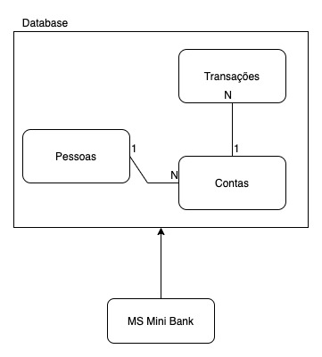

### Organização do projeto
Nas instruções foi identificado dois escopos de dados **pessoa/usuário** e **conta bancária**, será criado um micro-serviço (MS) para cada escopo a fim de segregar os dados. A comunicação entre os dois se dará por meio de chamadas gRPC.

O **MS Person** ficará encarregado das operações referentes aos dados da pessoa e também da autenticação.

o **MS BankAccount** ficará encarregado das  operações referentes a conta bancária.

Abaixo segue um diagrama de alto nível exemplificando a comunicação entre os dois MS e o escopo dos dados.

## Dependências
- [NodeJS LTS](https://nodejs.org/en/download/)
- [Docker](https://www.docker.com/products/docker-desktop)
- [Docker Compose](https://docs.docker.com/compose/install/)

## Instruções de execução

O projeto está configurado com um [Makefile](https://www.gnu.org/software/make/), abaixo estão listados os targets e uma breve descrição da sua funcionalidade.

- **make** ou **make all**

   - Executa `make db` e `make app`

- **make app**
    - Executa os MS simulando ambiente produtivo

- **make db**

    - Cria a estrutura de banco de dados

- **make seed**

    - Insere dados "fakes" no banco para fins de teste

- **make test**

    - Executa os testes unitários dos dois MS

- **make stop**

    - Para todos os containers em execução

- **make clean**

    - Exclui todos os containers relacionados, todas as dependências e arquivos temporários
